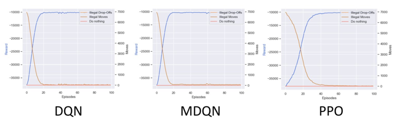
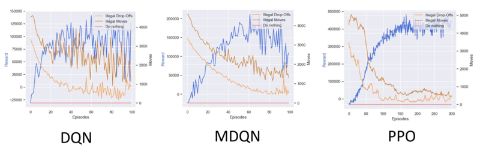
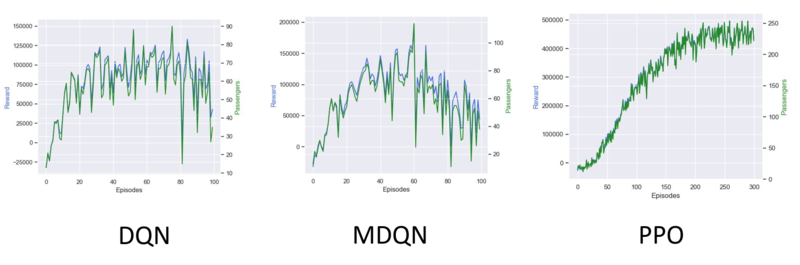

# Cablab

Development, improvement and testing of various reinforcement learning algorithms. <br>
Focus is on finding an effective algorithm for the cabworld. The algorithms can also be applied to all other OpenAiGym environments.

## Cabworld

In the cabworld a cab is driving around and tries to pick-up passengers to drive them to their destination.
Each passenger is marked with the same color as his destination. <br>
https://gitlab.com/nlimbrun/cabworld

## Currently implemented Algorithms

1. DQN
5. MDQN
2. A2C
3. PPO
4. MA-PPO (individual)

## Subtasks​

The cabworld is a relativly complex environment with different subtasks which can be seperated

### Subtask 1: Learn movements 



### Subtask 2: Learn pick-ups 



### Subtask 3: Learn to select passengers 




## Requirements 

- Pytorch 
- Gym-Cabworld 

## Usage 

```bash
python3 dqn.py 
python3 ppo.py 
...
```

## Changelog

### [0.1] (https://gitlab.com/nlimbrun/cablab/-/tags/release_0.1) (10.01.2021)
- Extended README