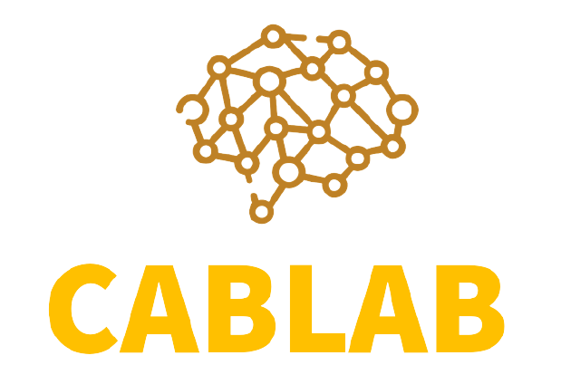

<div align="center">
		
</div>

<br/>
<div align="center">
	<a href="https://opensource.org/licenses/MIT">
		
	</a>
	<a href="https://opensource.org/licenses/MIT">
		
	</a>
</div>

# Cablab

Development, improvement and testing of various reinforcement learning algorithms. <br>
Focus is on finding an effective algorithm for the cabworld. The algorithms can also be applied to all other OpenAIGym environments.

## Cabworld

In the cabworld a cab is driving around and tries to pick-up passengers to drive them to their destination.
Each passenger is marked with the same color as his destination. <br>
https://gitlab.com/nlimbrun/cabworld

## Currently implemented Algorithms

### Single Agent

1. DQN (https://storage.googleapis.com/deepmind-media/dqn/DQNNaturePaper.pdf)
2. Munchhausen-DQN (https://arxiv.org/pdf/2007.14430.pdf)
3. A2C (https://papers.nips.cc/paper/1999/file/6449f44a102fde848669bdd9eb6b76fa-Paper.pdf)
4. PPO (https://arxiv.org/pdf/1707.06347.pdf)

### Multi Agent 

1. MA-DQN (individual)
2. MA-PPO (individual)


## Subtasks​

The cabworld is a relativly complex environment with different subtasks which can be seperated

1. Subtask 1: Learn movements 
2. Subtask 2: Learn pick-ups 
3. Subtask 3: Learn to select passengers 

## Requirements 

- Pytorch 
- Gym-Cabworld 

## Usage

### Training
```bash
python3 train.py -a ppo -n 100
python3 train.py -a dqn -n 100 -m True
```
```
usage: python3 train.py -a ALGORITHM -n NUMBER
error: the following arguments are required: -a/--algorithm, -n/--number, (-m/--munchhausen)
```

### Deploy 

Uses the most recent model

```bash
python3 deploy.py -a ppo -n 1 -w 0.05
```
```
usage: python3 deploy.py -a ALGORITHM -n NUMBER [-w WAIT]
error: the following arguments are required: -a/--algorithm, -n/--number
```

### Plots 

Every traning runs creates the following plots (here for single-agent-DQN)

<br>
<p>
	<div align="center">
		
		
		
	</div>
</p>
<br>


## Changelog

### [0.3] (https://gitlab.com/nlimbrun/cablab/-/tags/release_0.3) (27.01.2021)
- Added Multi-Agent, Munchhausen-Addon for DQN

### [0.2] (https://gitlab.com/nlimbrun/cablab/-/tags/release_0.2) (16.01.2021)
- Unified training and deployment, add CI

### [0.1] (https://gitlab.com/nlimbrun/cablab/-/tags/release_0.1) (10.01.2021)
- Extended README