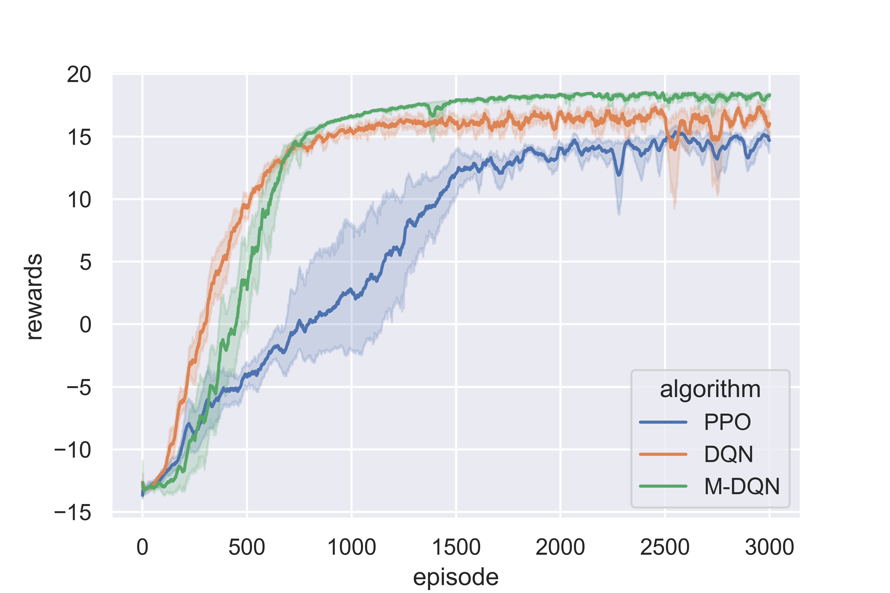
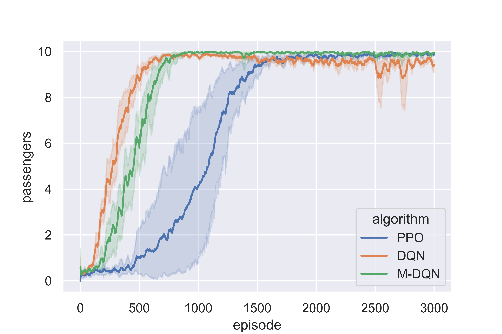
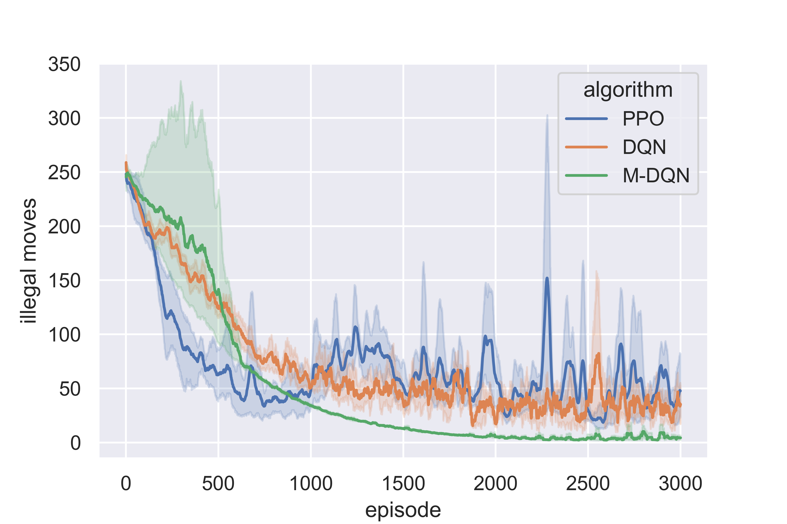
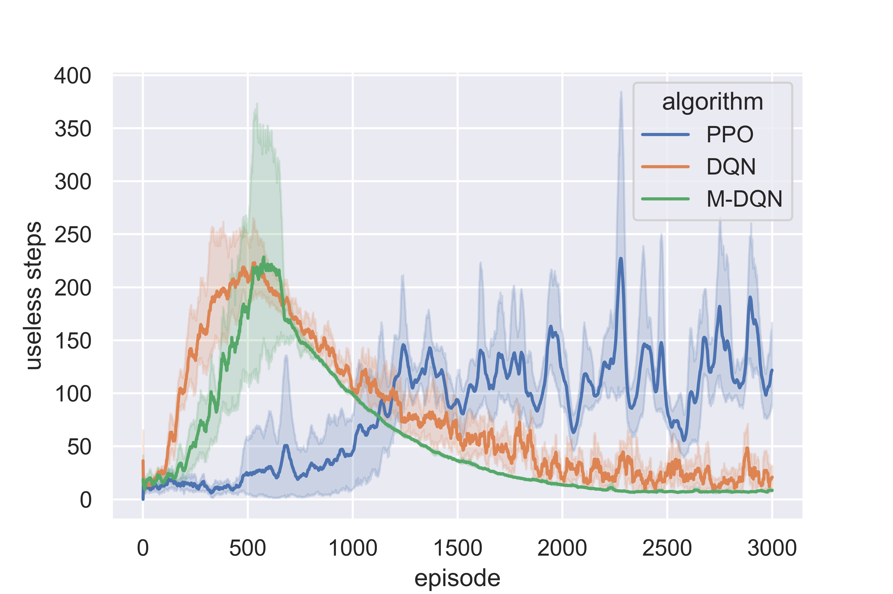

<div align="center">
		
</div>

<br/>
<div align="center">
	<a href="https://opensource.org/licenses/MIT">
		
	</a>
</div>

# Cablab

Development, improvement and testing of various reinforcement learning algorithms. <br>
Focus is on finding an effective algorithm for the [Cabworld](https://gitlab.com/nlimbrun/cabworld).
The algorithms can also be applied to all other OpenAIGym environments.

## Currently implemented Algorithms

### Single Agent

* [DQN](https://storage.googleapis.com/deepmind-media/dqn/DQNNaturePaper.pdf)
* [Munchhausen-DQN](https://arxiv.org/pdf/2007.14430.pdf)
* [PPO](https://arxiv.org/pdf/1707.06347.pdf)

### Multi Agent 

* MA-DQN with different extensions

### Archive 

* [A2C](https://papers.nips.cc/paper/1999/file/6449f44a102fde848669bdd9eb6b76fa-Paper.pdf)
* MA-PPO (individual)

#### AdvNet 

WIP: Seperate Network to enable agents to communicate

## Installation 

```bash
pip install -r requirements.txt
pip install -e .
```

## Usage

### Configuration 

Please use the config.toml files in cablab/configs

### Training
```bash
cd cablab
python3 train.py -a dqn -n 100 -env v0
python3 train.py -a ppo -n 100 -env v1
python3 train.py -a ma-dqn -n 100 -env v2
```
```
usage: python3 train.py -a ALGORITHM -n NUMBER -env ENVIRONMENT
error: the following arguments are required: -a/--algorithm, -n/--number, -env/--environment
```

### Deploy 

Uses the most recent model. Models can only be deployed in environments they were trained in.

```bash
python3 deploy.py -a ppo -n 10 -env v0 -r True
```
```
usage: python3 deploy.py -a ALGORITHM -n NUMBER -env ENVIRONEMTN [-w WAIT] [-r RENDER] [-e EVAL]
error: the following arguments are required: -a/--algorithm, -n/--number, -env/--environment
```

### Plots 

Every traning run creates basic plots and use-case specific plots. Example plots for Cabworld v0 for PPO, DQN and M-DQN
<br>
<p>
	<div align="center">
		
		
		
		
	</div>
</p>
<br>

